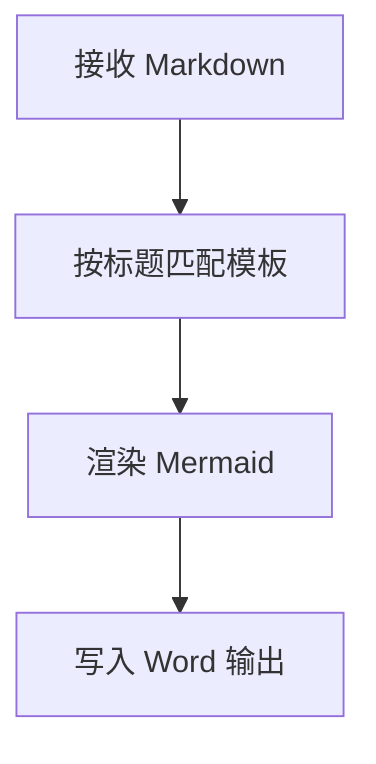

# 项目背景

这是项目背景章节内容，用于演示普通段落映射。

## 业务目标

- 降低手工排版成本
- 保持模板规范一致
- 支持流程图自动插入

## 核心流程


```mermaid
flowchart TD
    A[接收 Markdown] --> B[按标题匹配模板]
    B --> C[渲染 Mermaid]
    C --> D[写入 Word 输出]
```

## 风险与应对

```text
当模板标题缺失时，输出报告并提示人工补齐。
```

